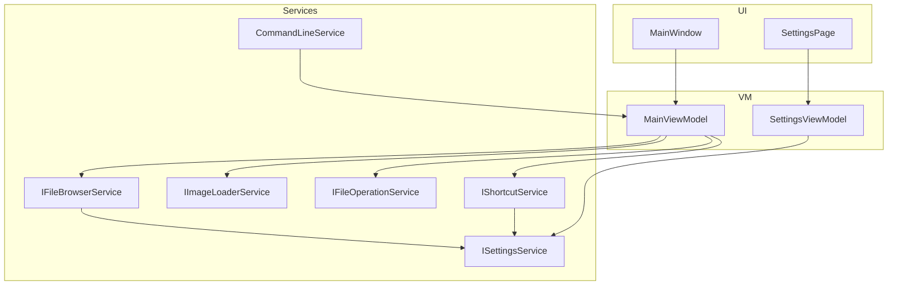

# Simple Viewer（WinUI 3）技术规格（SPEC）

## 设计目标

在 **纯 Windows / WinUI 3** 下重写现有 Python 看图器，达成 PRD 中的功能替代与体验目标，并针对旧版已知的性能与实现问题做定向改进。

| 维度 | 旧版现状（代码结论） | 新版目标 |
|------|---------------------|----------|
| 架构 | 单文件 `main.py` 承载 UI + 业务 | MVVM + 分层 Service，可测可扩展 |
| 解码 | PIL 全图 RGBA → QImage → QPixmap，GIF 全帧进内存 | WIC + 按视口解码 + 邻图预取 + GIF 原生动画 |
| 配置 | 工作目录旁 `config.json`，Qt 键名 | `%AppData%` 新 schema + 设置页，不兼容旧文件 |
| CLI | `ArgsParser.py`，`-d -i` 对**目录全部文件**排序（含非图片） | 与浏览逻辑一致：仅图片扩展名 + 自然排序 |
| UI | `theme.py` 深色 QSS | WinUI 3 Fluent（Mica / 标准控件 / InfoBar） |

---

## 现状代码探索摘要

### 涉及文件与职责

| 文件 | 职责 | 新版映射 |
|------|------|----------|
| `main.py` | 窗口、看图、GIF、快捷键、文件操作 | `MainWindow` + ViewModels + Services |
| `ArgsParser.py` | `file`、`-d`、`-i`、`-h` | `CommandLineService`（System.CommandLine） |
| `config.json` | `shortcut[]`：`key`、`modifier?`、`command`、`dir?` | `AppSettings.Shortcuts[]`（新 schema） |
| `theme.py` | 深色调色板 + QSS | WinUI `ThemeResource` / 系统主题 |
| `resource/*.json` | 键名/命令枚举参考（**未被 main.py 读取**） | 设置页枚举可内置或生成 |
| `script.spec` | PyInstaller → `viewer.exe` | `dotnet publish` → `viewer.exe` |

### 旧版核心行为（需对齐）

```115:134:d:\Dev\Python\simple_viewer\main.py
    def open_image(self, file=None):
        ...
            self.image_files = [
                os.path.join(directory, f) for f in os.listdir(directory)
                if f.lower().endswith(('.png', '.jpg', '.jpeg', '.gif'))
            ]
            self.image_files = natsorted(self.image_files)
```

- 支持扩展名：`.png` `.jpg` `.jpeg` `.gif`（大小写不敏感）。
- 目录列表使用 **自然排序**（`natsort.natsorted`）。
- 上一张/下一张：**循环**首尾；切换时 **旋转角归零**（`prev_image` / `next_image`）。
- 旋转：累计 `rotation_angle`，`reload_current_image()` 重新解码。
- 删除：`send2trash` → 从列表移除 → 显示下一张或清空。
- 移动：`shutil.move`，`os.makedirs(dest, exist_ok=True)`，从列表移除后 `update_current_image()`。
- 状态栏：`Name | Size | Dimensions | Index`（`update_status_bar` 会 **再次** `Image.open` 读尺寸）。

### 旧版缺陷（新版应修复，写入实现计划）

1. **CLI `-d -i` 与 UI 不一致**：`__init__` 对 `os.listdir` 全量自然排序后取索引，**未过滤图片扩展名**（`main.py` L46–48），与 `open_image` 行为不一致。新版统一走 `IFileBrowserService`。
2. **性能**：静态图每次 `convert("RGBA")` + 字节拷贝；GIF 预加载全部帧；切换无缓存；缩放使用高质量 SmoothTransformation。
3. **快捷键**：`keyPressEvent` 线性扫描；`resource/*.json` 未参与运行时校验。
4. **设置**：无 UI，需手改 JSON；含本机绝对路径（不宜作为新安装默认值）。

### 兼容性 / 迁移说明

- **不读取、不导入** 旧版 `config.json`（PRD 明确要求）。
- 首次启动写入 **默认快捷键**（语义对齐旧版默认，但 **移动目标路径默认为空**，由用户在设置页配置）。
- 可执行文件名：**`viewer.exe`**（与旧版脚本/习惯一致；项目名可为 `SimpleViewer`）。
- Python 仓库 **保留不删**；新项目位于独立目录（见下文结构），避免同仓混编。

---

## 总体方案

### 技术选型

| 项 | 选择 | 理由 |
|----|------|------|
| 运行时 | .NET 8 | LTS、WinUI 3 官方支持好 |
| UI 框架 | WinUI 3（Windows App SDK 1.6+） | PRD：Fluent、Win11 风格 |
| 模式 | MVVM（CommunityToolkit.Mvvm） | 分离快捷键/加载逻辑与 XAML |
| 命令行 | System.CommandLine | 对标 `ArgsParser.py`，易测 |
| 自然排序 | `NaturalSort.Extension` 或自实现 `NaturalStringComparer` | 对齐 `natsort` |
| 静态图解码 | `Microsoft.UI.Xaml.Media.Imaging.BitmapImage` + `DecodePixelWidth/Height` | WIC 原生、可按视口降采样 |
| 旋转 | `Image` 控件 `RotateTransform` | 避免重复解码；切换图片时归零 |
| GIF | `BitmapImage` / `Image` 直接设 `UriSource` | 系统动画，避免全帧缓存 |
| 回收站 | `Microsoft.VisualBasic.FileIO.FileSystem.DeleteFile(..., SendToRecycleBin)` 或 P/Invoke `SHFileOperation` | 无额外 NuGet 依赖优先前者 |
| 配置持久化 | `%LocalAppData%\SimpleViewer\settings.json` | 与安装目录解耦 |
| 测试 | xUnit + 服务层单元测试 | UI 以手动/清单验收为主 |

### 架构图



### 关键数据流

1. **启动**：`App` 解析 CLI → 若 `-h` 则控制台输出并退出 → 否则创建 `MainWindow`，`MainViewModel.InitializeAsync(launchOptions)`。
2. **打开文件**：`FileBrowser` 扫描目录 → 自然排序 → 更新 `ImageFiles` / `CurrentIndex` → `ImageLoader` 异步加载 → 更新 `ImageSource` + 状态栏。
3. **快捷键**：`MainWindow` 捕获 `KeyDown`（仅焦点在窗口时）→ `ShortcutService.TryMatch` → 执行 `ViewerCommand` 对应 `ICommand`。
4. **设置保存**：`SettingsViewModel` 校验绑定冲突 → `SettingsService.Save` → 通知 `MainViewModel` 重新加载绑定。

---

## 最终项目结构

使用 **git worktree** 在 `v2` 分支开发（与 `master` 上 Python 版并行）：

```
d:\Dev\Python\simple_viewer\           # master：现有 Python 版（保留）
d:\Dev\Python\simple_viewer-v2\        # v2 worktree：WinUI 3 新版
├── SimpleViewer.sln
├── src\
│   └── SimpleViewer\
│       ├── App.xaml / App.xaml.cs
│       ├── app.manifest
│       ├── Package.appxmanifest          # 可选，非 Store 分发可简化
│       ├── MainWindow.xaml / .xaml.cs
│       ├── Views\
│       │   └── SettingsPage.xaml / .xaml.cs
│       ├── ViewModels\
│       │   ├── MainViewModel.cs
│       │   └── SettingsViewModel.cs
│       ├── Models\
│       │   ├── AppSettings.cs
│       │   ├── ShortcutBinding.cs
│       │   ├── ViewerCommand.cs          # 枚举
│       │   └── LaunchOptions.cs
│       ├── Services\
│       │   ├── CommandLineService.cs
│       │   ├── FileBrowserService.cs
│       │   ├── ImageLoaderService.cs
│       │   ├── FileOperationService.cs
│       │   ├── ShortcutService.cs
│       │   └── SettingsService.cs
│       ├── Converters\                   # 可见性、格式化等
│       ├── Helpers\
│       │   └── NaturalStringComparer.cs
│       └── Assets\
│           ├── AppIcon.ico
│           └── SplashScreen.scale-200.png
└── tests\
    └── SimpleViewer.Tests\
        ├── FileBrowserServiceTests.cs
        ├── CommandLineServiceTests.cs
        ├── ShortcutServiceTests.cs
        └── NaturalStringComparerTests.cs
```

---

## 变更点清单

| 区域 | 变更类型 | 说明 |
|------|----------|------|
| Python `main.py` 等 | **不修改** | 旧版继续可用直至新版验收 |
| 新 WinUI 解决方案 | **新增** | 完整重写 |
| PRD 验收项 | **实现** | 见测试用例与步骤 |
| CLI `-d -i` | **行为修正** | 仅对图片文件排序取索引 |
| 配置 | **新 schema** | 见下节 |

### 新配置 schema（`settings.json`）

```json
{
  "version": 1,
  "shortcuts": [
    {
      "virtualKey": "Right",
      "modifiers": [],
      "command": "NextImage"
    },
    {
      "virtualKey": "D1",
      "modifiers": ["Control"],
      "command": "MoveToFolder",
      "targetPath": "D:\\classify\\level1"
    }
  ]
}
```

- `virtualKey`：Windows `VirtualKey` 名称字符串（设置页录制或下拉）。
- `modifiers`：`Control` | `Shift` | `Menu`（Alt）数组。
- `command`：`NextImage` | `PrevImage` | `RotateLeft` | `RotateRight` | `ToggleFullscreen` | `DeleteImage` | `ExitApp` | `MoveToFolder`。
- `targetPath`：仅 `MoveToFolder` 必填。
- **冲突策略**：保存时禁止完全相同 `(modifiers, virtualKey)`；设置页提示冲突。

### 默认快捷键（首次安装）

| 按键 | 命令 | 对应旧版 |
|------|------|----------|
| Right | NextImage | `Key_Right` |
| Left | PrevImage | `Key_Left` |
| Ctrl+A | RotateLeft | `ControlModifier` + `Key_A` |
| Ctrl+D | RotateRight | `ControlModifier` + `Key_D` |
| Escape | ExitApp | `Key_Escape` |
| F2 | ToggleFullscreen | `Key_F2` |
| Delete | DeleteImage | `Key_Delete` |
| MoveToFolder | **无默认路径** | 旧版 Ctrl+1~4 需用户在设置页配置 |

---

## 详细实现步骤

### 阶段 0：工程初始化（可验证：空窗启动）

1. 使用 Visual Studio 2022 模板创建 **Blank WinUI 3** 项目（.NET 8，Windows App SDK 1.6+）。
2. 添加 NuGet：`CommunityToolkit.Mvvm`、`System.CommandLine`、`NaturalSort.Extension`（或自写 Comparer）。
3. 配置 `ApplicationIcon`、窗口默认大小 1280×800、`MinWidth=800`、`MinHeight=600`（对齐旧版）。
4. 启用 Mica：`SystemBackdrop = MicaBackdrop`（Win11）；Win10 回退 `DesktopAcrylic`。
5. **验证**：F5 启动，主窗口 ≤2s 可见。

### 阶段 1：领域服务（可验证：单元测试通过）

1. **`FileBrowserService`**
   - `GetImagesInDirectory(string dir) → IReadOnlyList<string>`：过滤扩展名 + `NaturalStringComparer` 排序。
   - `ResolveLaunchIndex(files, int oneBasedIndex) → int`：越界时夹到 `[0, count-1]`（对齐旧版 `min(index-1, len-1)`）。
2. **`ImageLoaderService`**
   - `LoadAsync(path, decodeSize)`：`Task<LoadedImage>`。
   - 静态图：`BitmapImage`，根据 `decodeSize` 设置 `DecodePixelWidth` 或 `Height`（取限制视口较长边 × DPI）。
   - 元数据：`StorageFile` / `BitmapDecoder` 取 PixelWidth/Height，避免二次全图解码。
   - **LRU 缓存**：键 `(path, decodeSize, rotationBucket)`，容量建议 5–8；切换目录时清空。
   - **预取**：`CurrentIndex` 变化后，后台预取 `index±1`。
3. **`FileOperationService`**
   - `DeleteToRecycleBin(path)`。
   - `MoveToFolder(source, destDir)`：`Directory.CreateDirectory` + `File.Move`（跨盘时 copy+delete 可后续增强）。
4. **`SettingsService`**
   - 路径：`Environment.GetFolderPath(LocalApplicationData)\SimpleViewer\settings.json`。
   - `Load()` / `Save(AppSettings)`；缺失时写入默认。
5. **`ShortcutService`**
   - `TryMatch(VirtualKey, CoreVirtualKeyStates) → ViewerCommand?` + `MoveTargetPath`。
6. **`CommandLineService`**
   - 根命令：`viewer.exe [file] [-d dir] [-i index] [-h|--help]`。
   - `-h`：写入控制台帮助文本（对齐 `ArgsParser.show_help` 语义）。
   - 返回 `LaunchOptions`。
7. **验证**：xUnit 覆盖排序、CLI 解析、快捷键匹配、索引越界。

### 阶段 2：主界面 MVP（可验证：PRD 浏览/显示/状态栏）

1. **`MainWindow.xaml`**
   - 顶部 `CommandBar`：Open、Prev、Next、Rotate L/R、Delete、Settings。
   - 中央 `Grid` + `Image`（`Stretch=Uniform`）+ `RotateTransform`。
   - 底部 `InfoBar` 或自定义 StatusBar 文本绑定 `StatusText`。
2. **`MainViewModel`**
   - 属性：`ImageSource`、`StatusText`、`HasImage`、`IsFullscreen`。
   - 命令：`OpenFile`、`OpenFilePicker`、`Prev`、`Next`、`RotateLeft/Right`、`ToggleFullscreen`、`Delete`。
   - `OpenAsync(path)`：刷新列表 + 加载 + 更新状态栏（格式：`Name: {0} | Size: {1} | Dimensions: {2} | Index: {3}/{4}`）。
   - 窗口 `SizeChanged`：重新计算 `decodeSize` 并 `FitToWindow`（仅缩放显示，优先改 `Image` 布局而非重复解码；解码尺寸变化时才重新 Load）。
   - 旋转：修改 `RotationAngle`（0/90/180/270），**不重新解码**；`Prev`/`Next` 时归零。
3. **文件选择器**：`FileOpenPicker` 过滤 `png,jpg,jpeg,gif`。
4. **验证**：手动打开目录、切换、旋转、全屏、状态栏正确。

### 阶段 3：GIF、删除、移动（可验证：PRD 动图与文件操作）

1. **GIF**：检测扩展名 `.gif` → `ImageSource` 使用 `BitmapImage` URI，**不走** LRU 静态缓存；切换时释放 URI。**旋转**：与静态图相同，对 `Image` 控件应用 `RotateTransform`（不逐帧重解码）；切换上一张/下一张时旋转角归零。
2. **删除**：确认可选（首次可用 `ContentDialog`）→ 回收站 → 从 `ImageFiles` 移除 → 若列表空则清空 `ImageSource` 与状态栏。
3. **移动**：`MoveToFolder` 命令从快捷键或未来工具栏调用 → 移动后同删除逻辑切下一张。
4. **验证**：GIF 播放；删除后文件在回收站；移动后源目录不存在、目标存在。

### 阶段 4：快捷键与设置页（可验证：PRD 设置项）

1. **`SettingsPage`**
   - `ListView` 展示绑定：显示键位、命令、目标路径。
   - 添加/编辑：`ComboBox` 选命令；`MoveToFolder` 显示 `TextBox` + `FolderPicker`；键位「录制」按钮捕获下一键（含修饰键）。
   - 保存/取消；冲突检测。
2. **`MainWindow` 键盘路由**
   - `PreviewKeyDown` 调用 `ShortcutService`；未匹配则不处理（避免吞掉系统键）。
   - 设置页打开时禁用全局快捷键或仅 Esc 关闭。
3. **验证**：修改 Ctrl+数字 移动路径，重启后仍生效；默认无移动路径时不崩溃。

### 阶段 5：CLI 与打包（可验证：PRD 命令行）

1. `App.OnLaunched` 中解析 `e.Arguments`；`-h` 时 `AllocConsole` 或 `AttachConsole` 输出帮助后 `Environment.Exit(0)`。
2. `LaunchOptions` 驱动初始打开逻辑（file / directory+index）。
3. **发布**：
   ```powershell
   dotnet publish -c Release -r win-x64 --self-contained false -p:PublishSingleFile=true
   ```
4. **验证**：`viewer.exe -d D:\pics -i 10` 打开第 10 张 **图片**；`-h` 输出帮助。

### 阶段 6：性能与体验收尾（可验证：PRD 非功能）

1. 切换计时：确保主线程不阻塞 — `LoadAsync` + `ConfigureAwait(true)` 更新 UI。
2. 大图：20MB+ 必须设置 `DecodePixelWidth`，禁止全像素解码后缩放。
3. 快速切换 20 次：预取 + 缓存命中应无明显白屏。
4. Fluent 视觉走查：CommandBar 图标（Segoe Fluent Icons）、统一间距、深色/浅色跟随系统。
5. **验证**：满足 PRD 非功能验收清单。

---

## 测试策略

### 自动化（xUnit）

| 用例 ID | 输入 | 期望 |
|---------|------|------|
| T-FB-01 | 目录含 `img2.jpg`, `img10.jpg` | 自然排序为 img2 → img10 |
| T-FB-02 | 目录含 `.txt` + `.png` | 列表仅 png |
| T-FB-03 | `-i 999`，仅 3 张图 | 索引为 2（第 3 张） |
| T-CLI-01 | `file.png` | `LaunchOptions.FilePath` 正确 |
| T-CLI-02 | `-d C:\pics -i 2` | 目录+索引 |
| T-SK-01 | 配置 Right → Next | 匹配 NextImage |
| T-SK-02 | 重复绑定 | `Save` 抛出或返回校验错误 |
| T-ST-01 | 无 settings 文件 | 生成默认 JSON |

### 手动验收（对齐 PRD）

直接复用 `prd.md` 中 **验收标准** 全部 Given/When/Then 条目；额外执行：

- [ ] 连续快速切换 20 次（<5MB JPG）无长时间假死。
- [ ] 打开 4K/20MB+ 图，全屏切换后可操作。
- [ ] 冷启动无参数 ≤2s 见窗。
- [ ] 旧 `config.json` 放同目录 **不影响** 新应用行为。

### UI 测试（本期不做）

- WinAppDriver / Appium 不纳入第一版；依赖手动清单。

---

## 风险与回滚方案

| 风险 | 影响 | 缓解 | 回滚 |
|------|------|------|------|
| WinUI 3 环境/SDK 版本不一致 | 无法编译 | 文档锁定 SDK 1.6+、VS 17.10+ | 继续用 Python 版 |
| `BitmapImage` 大图仍占内存 | 切换卡顿 | 强制 `DecodePixelWidth`、限制缓存大小 | 调小缓存/解码尺寸 |
| GIF 与旋转/transform 冲突 | 显示异常 | 统一用 `RotateTransform`，不逐帧解码；若异常再降级提示 | 记录 issue，临时禁用 GIF 旋转 |
| 回收站 API 权限 | 删除失败 | try/catch + InfoBar 错误 | 用户手动删除 |
| 快捷键与系统冲突 | 部分键无效 | 设置页提示；可改绑 | 恢复默认设置 |
| 非 Store 打包复杂 | 分发困难 | 提供 `publish` 脚本 + 绿色 zip | 开发者本机 `dotnet run` |

**回滚策略**：Python 版不删除；`v2` worktree 构建的 `viewer.exe` 与 master 产物同名，验收前通过路径或分支区分；验收通过后在 `v2` 分支替换分发。

---

## 实现顺序总览（检查清单）

- [ ] 阶段 0：工程初始化
- [ ] 阶段 1：领域服务 + 单元测试
- [ ] 阶段 2：主界面 MVP
- [ ] 阶段 3：GIF / 删除 / 移动
- [ ] 阶段 4：设置页 + 快捷键
- [ ] 阶段 5：CLI + 打包
- [ ] 阶段 6：性能与 Fluent 收尾

---

## 已确认事项（2026-05-19）

| 项 | 决定 |
|----|------|
| 开发方式 | Git worktree：`d:\Dev\Python\simple_viewer-v2\`，分支 **`v2`**，后续推送到本仓库 `origin/v2` |
| 可执行文件名 | **`viewer.exe`** |
| GIF 旋转 | **支持**（`RotateTransform`，与静态图一致） |

**SPEC 已确认，可进入编码阶段。**
